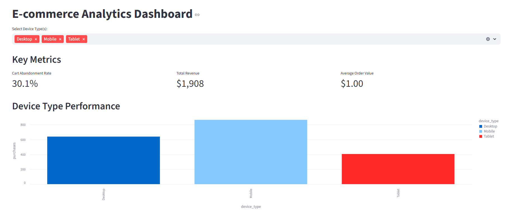
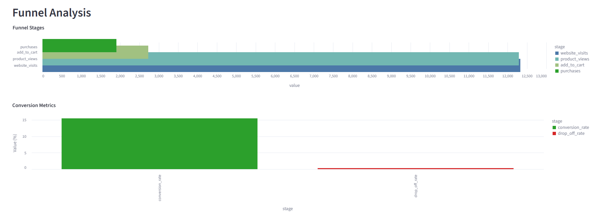
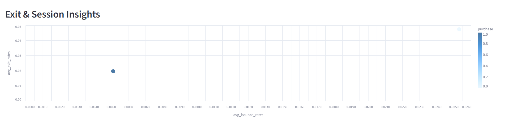

# Marketing Funnel Analysis

A comprehensive marketing funnel analysis project utilizing modern data engineering and visualization tools to transform raw marketing data into actionable insights.

## 🏗️ Architecture Overview

This project implements a complete data pipeline from raw data ingestion to interactive visualizations:

```
UCI Repository → Databricks → dbt → Streamlit Dashboard
```

## 🛠️ Tech Stack

- **Data Source**: UCI ML Repository
- **Data Processing**: Databricks (PySpark, Pandas)
- **Data Transformation**: dbt (Data Build Tool)
- **Visualization**: Streamlit
- **Storage**: Delta Lake (Databricks)

## 📊 Project Workflow

### Step 1: Data Ingestion & Initial Processing
- **Location**: Databricks Notebook (`UCI Data.ipynb`)
- **Process**:
  - Fetch marketing dataset from UCI repository using `ucimlrepo`
  - Perform data transformation using PySpark and Pandas
  - Store cleaned data as Delta table named `source_data`
- **Output**: `source_data` Delta table in Databricks

### Step 2: Data Modeling with dbt
- **Setup**: Install `dbt-databricks` and `dbt-core` in Visual Studio Code
- **Process**:
  - Create dbt models on top of `source_data` table
  - Build staging, intermediate, and mart layers
  - Transform raw data into analysis-ready datasets
- **Output**: Mart tables optimized for analysis and visualization

### Step 3: Visualization & Dashboard
- **Tool**: Streamlit
- **Process**:
  - Connect to Databricks mart tables
  - Generate interactive visualizations
  - Create marketing funnel analysis dashboard
- **Output**: Interactive web-based dashboard





## 🚀 Getting Started

### Prerequisites

- Databricks workspace access
- Visual Studio Code
- Python 3.7+
- Git

### Running the Project

1. **Data Ingestion** (Databricks)
   ```python
   # Run UCI Data.ipynb notebook in Databricks
   # This will create the source_data Delta table
   ```

2. **dbt Transformation**
   ```bash
   # Run dbt models
   dbt run
   
   # Test data quality
   dbt test
   ```

3. **Launch Dashboard**
   ```bash
   # Start Streamlit app
   streamlit run streamlit_viz.py
   ```

## 📁 Project Structure

```
marketing-funnel-analysis/
├── notebooks/
│   └── UCI Data.ipynb          # Data ingestion notebook
├── marketing_funnel_analytics/
│   ├── models/
│   │   ├── staging/           # Staging models
│   │   ├── intermediate/      # Intermediate transformations
│   │   └── marts/            # Business logic models
│   ├── dbt_project.yml
│   └── profiles.yml
├── streamlit_app/
│   ├── streamlit_viz.py                # Main Streamlit application
│   └── streamlit_viz.ipynb
└── README.md
```

## 🔧 Configuration

### Databricks Connection
Update your `profiles.yml` file:

```yaml
your_profile_name:
  target: dev
  outputs:
    dev:
      type: databricks
      host: <your-databricks-host>
      http_path: <your-cluster-http-path>
      token: <your-access-token>
      catalog: <your-catalog>
      schema: <your-schema>
```

### Environment Variables
Create a `.env` file for sensitive configurations:

```env
DATABRICKS_HOST=<your-databricks-host>
DATABRICKS_TOKEN=<your-access-token>
DATABRICKS_HTTP_PATH=<your-cluster-http-path>
```

## 🤝 Contributing

1. Fork the repository
2. Create your feature branch (`git checkout -b feature/AmazingFeature`)
3. Commit your changes (`git commit -m 'Add some AmazingFeature'`)
4. Push to the branch (`git push origin feature/AmazingFeature`)
5. Open a Pull Request

## 📝 License

This project is licensed under the MIT License - see the [LICENSE](LICENSE) file for details.

## 🙏 Acknowledgments

- UCI Machine Learning Repository for providing the dataset
- Databricks community for excellent documentation
- dbt Labs for the powerful transformation framework
- Streamlit team for the intuitive visualization platform

---

**Built with ❤️ using Databricks, dbt, and Streamlit**